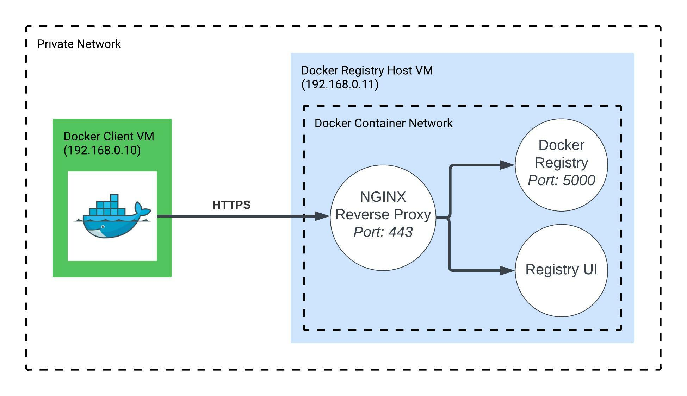

# Private Docker Registry Setup

This guide is written for **Ubuntu 22.04** and hosted inside of a private network such a home or office setting with no public access to the registry.



---

## Helpful Links:
- [Configure Docker Registry](https://docs.docker.com/registry/configuration/)
- [Docker Registry UI Github](https://github.com/Joxit/docker-registry-ui)

---

## Getting Started

You will need the files include in this repository. Either copy them one by one or clone them down to your machine.

## Define NGINX Proxy Pass

The combo of the registy ui and docker registry leverage NGINX inside the ui container. In order to properly connect the two with out CORS issues, you need to properly pass the request from the ui to the registry API. Replace in `nginx.conf` file, the proxy_pass line with `<registry-ip-or-domain>` to the proper IP of the host system. 

## Create Self Sign Certificate

Because the registry is located in a private network. A self sign certificate for work just fine to encrypt traffic. Run the following to create the certificate. Make sure to replace `<IP-ADDRESS>` for the host system.

```sh
mkdir ./certs

openssl req -newkey rsa:2048 -nodes -keyout certs/privkey.pem -x509 -days 365 -out certs/fullchain.pem -addext 'subjectAltName = IP:<IP-ADDRESS>'
```

## Run Docker Compose

To start the service just run the docker compose file.

```
sudo docker compose -f docker-compose.yml up -d
```

---

## Enable Docker Daemon Private Registry Access

By default Docker disallows being able to push/pull images to registry with self signed certificates. In the file `/etc/docker/daemon.json` you want to add the following, just make sure to set your registry address and port correctly...

```json
{
    "insecure-registries" : ["<registry-ip-or-domain>:<port>"]
}
```

Restart the Docker daemon

```sh
sudo systemctl restart docker
```
